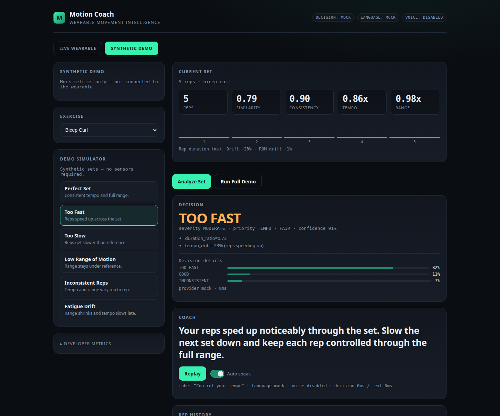

# Motion Coach

[](https://github.com/kovac04/motion-coach/actions/workflows/ci.yml)


Motion Coach is a wearable movement-analysis system that streams wrist IMU data from an
ESP32-C5 over BLE and provides real-time exercise feedback.

Movement is calibrated, segmented, and scored with deterministic signal processing. Jev,
Gemini, and ElevenLabs are limited to bounded issue selection, cue phrasing, and voice delivery.

[](https://www.youtube.com/watch?v=WHgj9EYAbHU)

**[Watch the demo (3:24)](https://www.youtube.com/watch?v=WHgj9EYAbHU)**

## Technical highlights

- **Reliable sensor path:** samples a 6-axis IMU at 50 Hz, transports custom 18-byte BLE
  packets, and handles sequence gaps, backpressure, and automatic reconnection.
- **Mounting-independent analysis:** learns the dominant movement axis with PCA, segments reps
  with a deterministic state machine, and computes per-rep and set-level metrics.
- **Bounded, fail-soft coaching:** establishes candidate deviations from robust metrics before
  invoking AI providers, falls back deterministically on provider failures, and is covered by
  99 backend tests.

## Architecture

```text
MPU6050 --I2C--> XIAO ESP32-C5 --BLE 50 Hz--> Mac
        │
        ▼
  SensorRuntime (one BLE owner, auto-reconnect, bounded buffer)
        │
        ▼
  PCA projection -> rep segmentation -> RepMetrics / SetMetrics   (deterministic)
        │
        ▼
  deviation assessment (robust medians, majority rule)             (deterministic)
        │
        ▼
  Jev      -> MovementDecision   (bounded decisions; not prose)
  Gemini   -> CoachingResponse   (one short cue)
  ElevenLabs -> speech
        │
        ▼
  React dashboard (live) / spoken coaching
```

## Quick start

```bash
make install     # uv sync (backend) + npm install (frontend)
make backend     # http://localhost:8000
make frontend    # http://localhost:5173
```

The dashboard has two clearly separated tabs:

- **SYNTHETIC DEMO** — mock metrics, works with **no hardware and no API keys**.
- **LIVE WEARABLE** — the real pipeline. Requires `SENSOR_ENABLED=true` in `.env` and the
  powered wearable in BLE range.

Provider and network failures fall back to deterministic behavior without interrupting the demo.

## Stack

Python 3.12 · FastAPI · Pydantic · uv · bleak · NumPy · Vite · React · TypeScript · pytest ·
PlatformIO (ESP32-C5)

## Live wearable flow

1. **Calibrate** the exercise (3-2-1 countdown → **hold still** for a quiet baseline →
   **5 controlled reps**). The profile is saved per exercise.
2. **Start Set** → perform the set → **Finish Set** (or stop moving ~3 s for auto-finish).
3. The completed set runs `SetMetrics → Jev → Gemini → ElevenLabs`, updates the main
   dashboard, and speaks **one** cue.

A GOOD set shows *"Good set"* with positive text but is **not spoken** — only a meaningful,
objectively-detected deviation is. The UI labels **VOICE: ELEVENLABS** vs **BROWSER FALLBACK**.

## Intelligence layers

| Layer | Who | Responsibility |
| --- | --- | --- |
| A. Measurement | deterministic code | duration/ROM/peak ratios, smoothness, similarity, consistency |
| B. Deviation | deterministic code | robust medians + majority rule → `candidate_issues` |
| C. Decision | Jev | choose **among established candidates** (or only severity for one) |
| D. Language | Gemini | one concise end-of-set cue (15-25 words, max 32) |
| E. Voice | ElevenLabs | speaks the final text (`mp3_44100_128`, `eleven_v4_turbo`) |

Jev receives only deviations established by deterministic metrics. Clearly good sets bypass Jev
and spoken coaching. See `docs/MOTION.md`.

## Exercises

Live-selectable: **Bicep Curl, Lateral Raise, Triceps Extension, Front Raise**. Each learns
its own PCA axis and saves its own profile (`data/profiles/<id>.json`); nothing is shared.
The pipeline targets cyclical wrist rotation, so bench press is excluded because wrist
translation makes gyro excursion unreliable.

## Provider modes

Set in `.env` (copy `.env.example`):

| Variable | Values | Default |
| --- | --- | --- |
| `DECISION_PROVIDER` | `mock` `jev` `fallback` | `mock` |
| `LANGUAGE_PROVIDER` | `mock` `gemini` `fallback` | `mock` |
| `VOICE_PROVIDER` | `elevenlabs` `browser` `disabled` | `browser` |

Fail-soft: Jev → rules engine; Gemini → templates; ElevenLabs → browser `speechSynthesis`.
Credentials live only server-side (`.env`, gitignored) and are never exposed to the frontend.
Live Jev/Gemini calls have a configurable latency budget (`LIVE_JEV_TIMEOUT_S`,
`LIVE_GEMINI_TIMEOUT_S`, default 2 s) after which the deterministic fallback is used.

## Commands

```bash
# App
make backend / make frontend / make test / make build / make lint

# Provider smoke tests (intentional, never run in pytest)
make smoke-pipeline   # offline full pipeline over all scenarios (no keys)
make smoke-gemini / smoke-elevenlabs / smoke-jev

# Firmware (PlatformIO)
make firmware-build / firmware-upload / firmware-monitor

# Real IMU over BLE (wearable powered + advertising)
make imu-monitor                 # live ~50 Hz diagnostics
make imu-record NAME=good-01     # record to data/recordings/ (Ctrl-C to stop)
make imu-plot / imu-analyze FILE=data/recordings/…
make imu-calibrate               # build a profile from good recordings
make imu-segment FILE=… | ALL=1  # offline rep detection + debug plot
make live-debug FILE=data/debug/live-set-….csv   # replay a saved live set
```

Recording protocol: `docs/DATA_COLLECTION.md`.

## Hardware and sensor pipeline

Single XIAO ESP32-C5 reads an MPU6050 directly over I2C and streams 18-byte little-endian
packets over BLE at ~50 Hz; the Mac is the BLE central.

- Firmware, wiring, bring-up: `firmware/esp32-wearable/README.md`
- SDA=`D4`/GPIO23, SCL=`D5`/GPIO24, sensor address `0x68` (AD0 may be unconnected)
- Ranges: accel ±4 g, gyro ±1000 dps; packet `uint16 seq | uint32 t_ms | 6×int16`
- `SensorRuntime` owns exactly one BLE connection with automatic rescan/reconnect
- Calibration: quiet-window rest baseline → PCA dominant rotation axis → projected gyro →
  rep state machine → reference duration/excursion/peak/waveform

`rom_deg` is **movement excursion relative to the personal reference**, not true joint angle.
The detector fits clear cyclical rotational wrist motion.

## Testing

```bash
make test   # 99 backend tests + frontend production build
make lint   # frontend lint
```

CI runs the backend suite and frontend lint/build on every push and pull request. Tests cover BLE
packet parsing and buffering, APIs and WebSockets, calibration and segmentation, exercise
switching, provider boundaries, and fallback behavior. No API keys or BLE hardware are required.

## Docs

- `docs/ARCHITECTURE.md` — layers, boundaries, metric conventions, sensor boundary
- `docs/MOTION.md` — PCA projection, segmentation, calibration, decision contract
- `docs/DATA_COLLECTION.md` — recording protocol and inspection workflow
- `docs/API.md` — HTTP/WebSocket endpoints
- `docs/JEV_PROVIDER.md` — the verified Jev (TypeSafe) contract
- `docs/BUILD_LOG.md` — provenance / timestamps

## Project provenance

Motion Coach was built during StormHacks 2026. Development timestamps and implementation
milestones are recorded in `docs/BUILD_LOG.md`; architectural decisions are documented in
`docs/ARCHITECTURE.md`.
